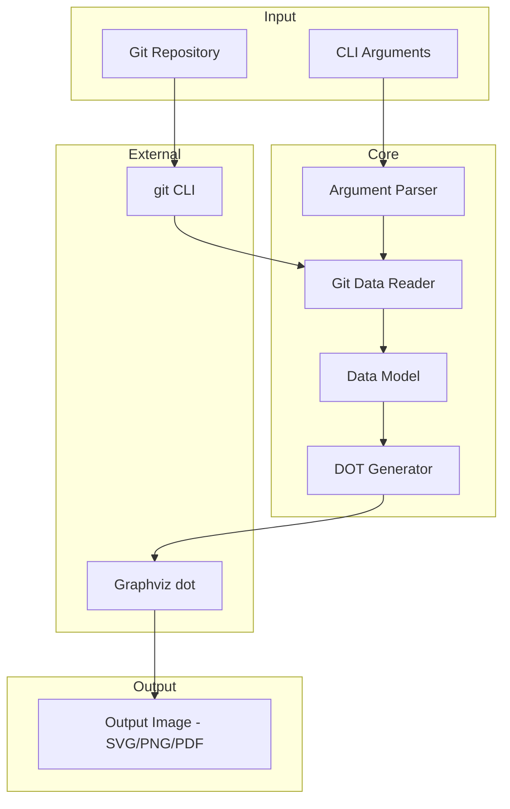
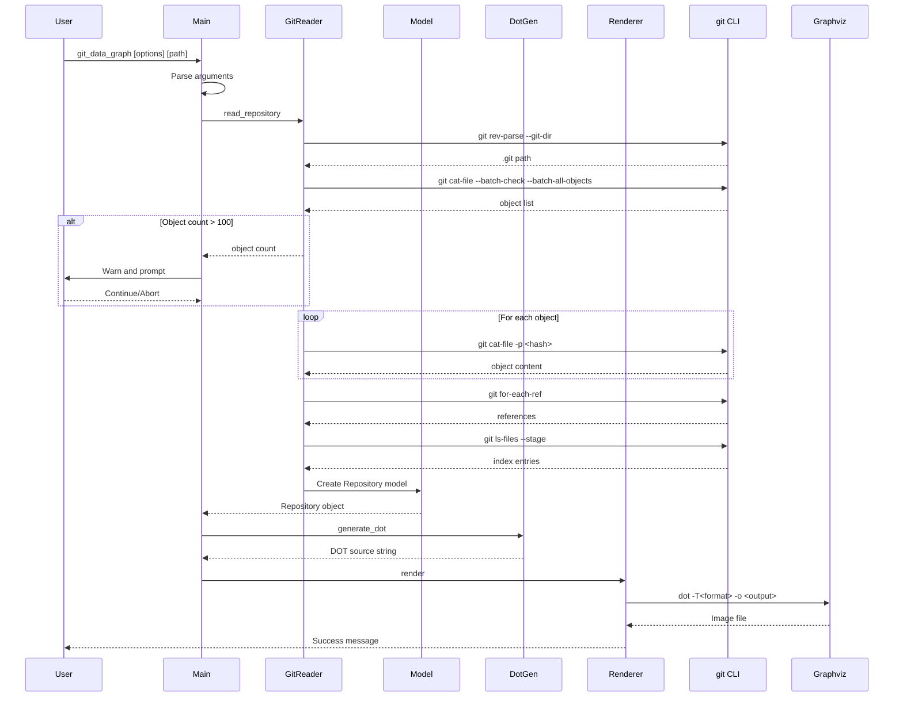
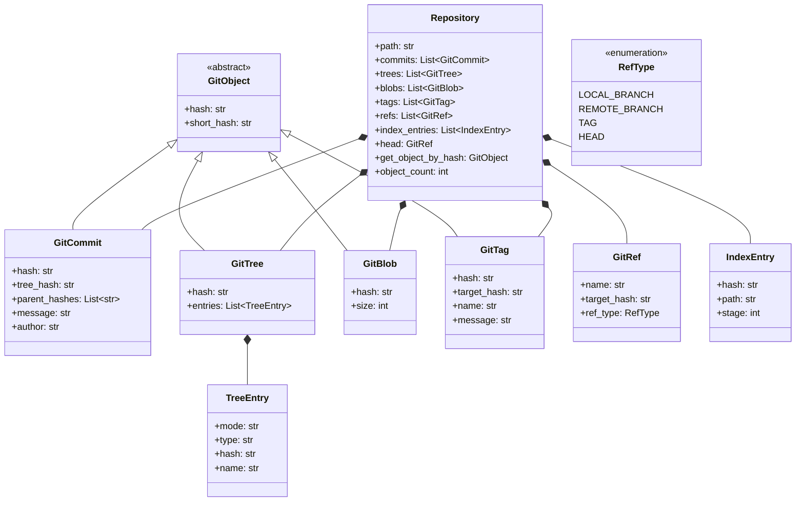

# Software Architecture: Git Data Graph

## 1. Overview

**git_data_graph** is a Python CLI tool that creates graphical representations of Git repository internals for educational purposes. It reads Git objects and references using the `git` CLI and renders them as a graph using Graphviz.

### Key Design Decisions

| Aspect | Decision | Rationale |
|--------|----------|-----------|
| Git Data Access | `git` CLI commands | Minimal dependencies, handles packfiles automatically |
| Graph Rendering | Graphviz `dot` | Industry standard, supports multiple output formats |
| Python Version | 3.6+ | Compatibility requirement |
| Cross-platform | Yes | Windows and Unix/Linux support |

## 2. High-Level Architecture



## 3. Module Structure

```
src/
├── __init__.py
├── main.py              # Entry point, CLI handling
├── git_reader.py        # Git CLI wrapper, data extraction
├── model.py             # Data classes for Git objects
├── dot_generator.py     # DOT language generation
├── renderer.py          # Graphviz invocation, output handling
└── utils.py             # Cross-platform utilities, path handling
```

### Module Responsibilities

#### main.py
- Parse command-line arguments using `argparse`
- Validate input path is a Git repository
- Coordinate the workflow between modules
- Handle user prompts for large repositories
- Exit codes and error messages

#### git_reader.py
- Execute `git` CLI commands via `subprocess`
- Parse Git object data from commands:
  - `git cat-file --batch-check --batch-all-objects` - list all objects
  - `git cat-file -p <hash>` - read object contents
  - `git for-each-ref` - list all references
  - `git symbolic-ref HEAD` - resolve HEAD
  - `git ls-files --stage` - read index entries
- Handle Git command errors gracefully

#### model.py
- Define data classes for Git entities:
  - `GitCommit` - hash, tree, parents, message, author
  - `GitTree` - hash, entries list
  - `GitBlob` - hash, size
  - `GitTag` - hash, target, name, message
  - `GitRef` - name, target hash, ref type
  - `IndexEntry` - hash, path, stage
  - `Repository` - collection of all objects and refs

#### dot_generator.py
- Convert model objects to DOT language
- Apply visual styling:
  - Commits: yellow ellipse
  - Trees: green folder shape
  - Blobs: blue cylinder
  - Tags: orange note shape
  - Refs: gray box
- Generate edges for relationships
- Create HTML table for index entries
- Handle hash abbreviation (7 chars)

#### renderer.py
- Invoke Graphviz `dot` command
- Detect output format from file extension
- Support SVG, PNG, PDF output
- Handle Graphviz errors

#### utils.py
- Cross-platform path handling using `os.path`
- Git repository validation
- Subprocess execution wrapper

## 4. Data Flow



## 5. Data Model



## 6. External Dependencies

### Runtime Dependencies

| Dependency | Purpose | Required |
|------------|---------|----------|
| Python 3.6+ | Runtime | Yes |
| Git CLI | Read repository data | Yes |
| Graphviz | Render graphs | Yes |

### Python Standard Library Modules Used

- `argparse` - CLI argument parsing
- `subprocess` - Execute external commands
- `os`, `os.path` - File system operations, cross-platform paths
- `sys` - Exit codes, stdin/stdout
- `typing` - Type hints (Python 3.6 compatible)

### Optional Third-Party Libraries

None required. The design intentionally minimizes dependencies.

## 7. CLI Interface

```
usage: git_data_graph [-h] [-o OUTPUT] [--no-index] [-s] [--force] [path]

Generate a graph visualization of Git repository internals.

positional arguments:
  path                  Path to Git repository (default: current directory)

optional arguments:
  -h, --help            Show help message and exit
  -o OUTPUT, --output OUTPUT
                        Output file path (default: git_data_graph.svg)
  --no-index            Exclude index table from output
  -s, --short           Short mode: show only refs and commits (hide trees/blobs)
  --force               Skip confirmation for large repositories
```

### Exit Codes

| Code | Meaning |
|------|---------|
| 0 | Success |
| 1 | Invalid Git repository |
| 2 | Git command not found |
| 3 | Graphviz not found |
| 4 | User aborted (large repo warning) |
| 5 | Output file write error |

## 8. Visual Styling Specification

### Node Styles

| Object Type | Shape | Fill Color | Border |
|-------------|-------|------------|--------|
| Commit | ellipse | #ffff99 (yellow) | black |
| Tree | folder | #99ff99 (green) | black |
| Blob | cylinder | #99ccff (blue) | black |
| Tag Object | note | #ffcc99 (orange) | black |
| Reference | box | #cccccc (gray) | black |
| HEAD | box | #cccccc (gray) | bold |

### Edge Styles

| Relationship | Style | Color |
|--------------|-------|-------|
| Commit → Parent | solid arrow | black |
| Commit → Tree | solid arrow | darkgreen |
| Tree → Entry | solid arrow | darkgreen |
| Tag → Target | dashed arrow | orange |
| Ref → Commit | dotted arrow | gray |
| HEAD → Ref | bold dotted | gray |

### Graph Layout

- Direction: Left to Right (rankdir=LR)
- Index table: Positioned at bottom using subgraph

## 9. Error Handling Strategy

1. **Invalid Repository Path**
   - Check with `git rev-parse --git-dir`
   - Exit with code 1 and descriptive message

2. **Missing Git CLI**
   - Check at startup with `git --version`
   - Exit with code 2 and installation instructions

3. **Missing Graphviz**
   - Check at startup with `dot -V`
   - Exit with code 3 and installation instructions

4. **Large Repository Warning**
   - Count objects before detailed reading
   - Prompt user if > 100 objects
   - Exit with code 4 if user aborts
   - `--force` flag skips prompt

5. **Git Command Failures**
   - Wrap in try/except
   - Log error details
   - Continue with partial data when possible

## 10. Future Considerations

These are not in scope but documented for future enhancement:

- **Interactive HTML output** - Clickable nodes with object details
- **Filtering options** - Show only specific branches or paths
- **Diff visualization** - Compare two commits
- **Watch mode** - Auto-regenerate on repository changes
- **Object content preview** - Show blob contents in tooltips
